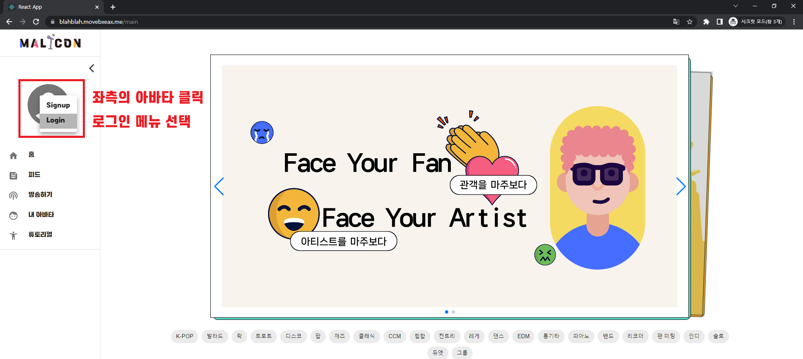
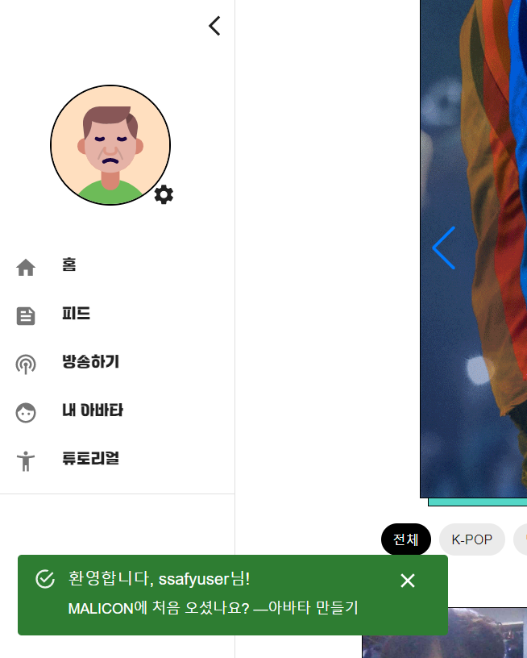
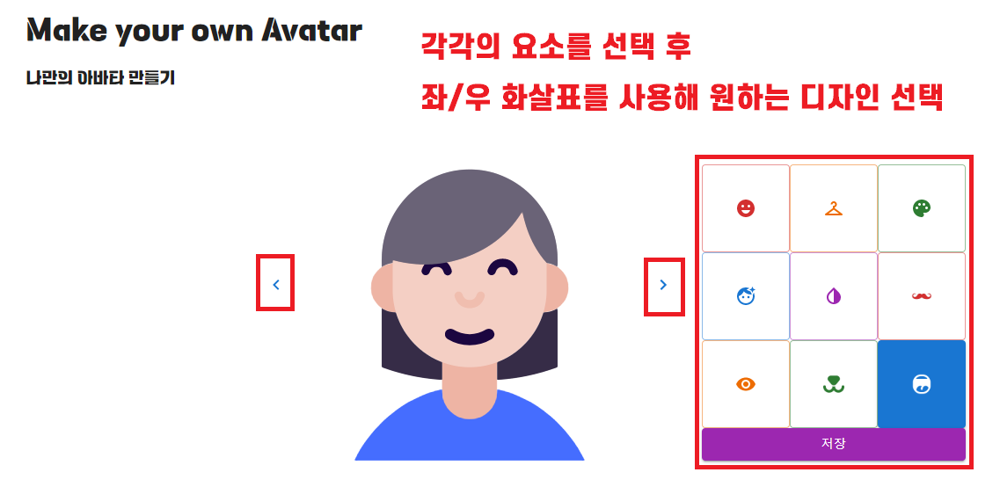
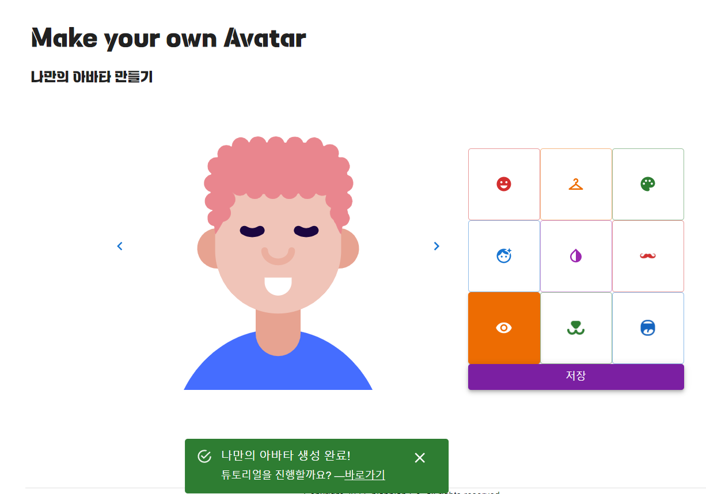
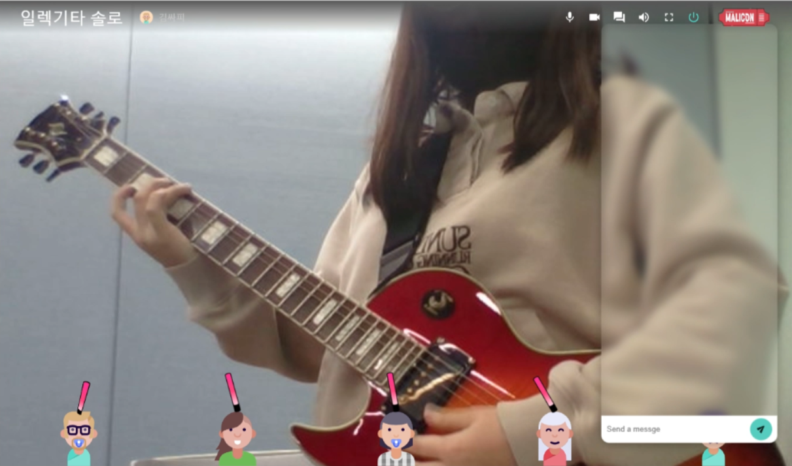
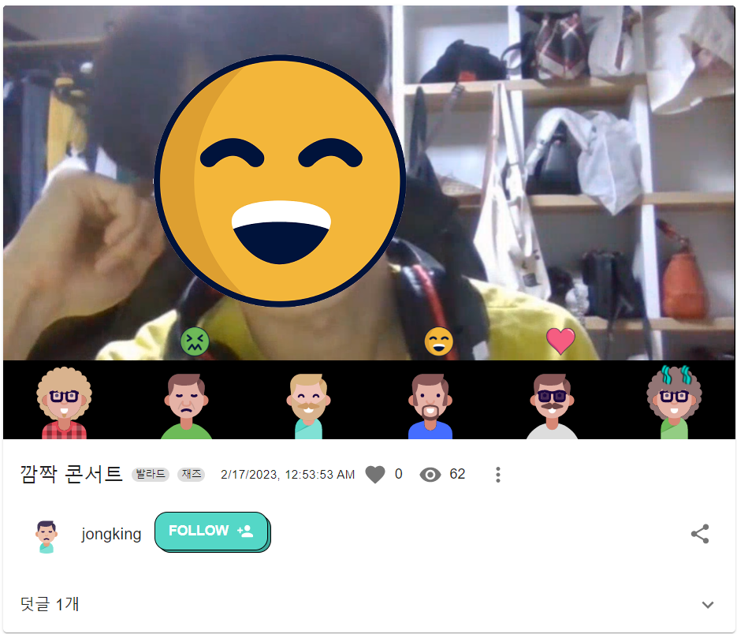

## 시연 시나리오

1. 랜딩페이지

   

2. 메인페이지

   

3. 로그인(ssafyuser/1234)

   1. 아래 뜨는 스낵바 클릭 (아바타 설정)

   

4. 아바타 설정

   

   

   아바타 생성 이후 아래 스낵바 클릭(튜토리얼)

   

5. 튜토리얼

   

6. 방송 입장
   1. 방송 시청하며 채팅창, 감정표현 실행
      
7. 다시보기 비디오
   
   1. 비디오 중간까지 넘겨서 감정표현 보여주기
   2. 좋아요 누르기
   3. 덧글 달기
